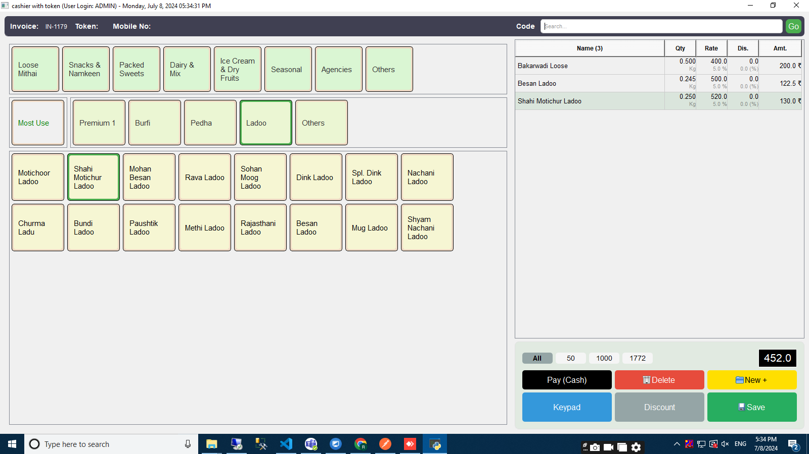

# SweetPOS: Billing and Inventory Management System

## Overview
**SweetPOS** is a billing and inventory management solution for sweet shops and franchises. It supports real-time invoice generation, dynamic discounting, and GST calculations.

## My Role
- Spearheaded the front-end development using **React.js** for the web application.
- Designed and developed responsive UI components with Material UI.
- Optimized performance by reducing loading times by 35% through code-splitting and lazy loading.
- Collaborated with backend developers to integrate REST APIs for real-time data synchronization.

## Technologies
- **Frontend**: React.js, Redux
- **Mobile**: React Native
- **Backend**: Python
- **Database**: MySQL

## Features
- Billing system with real-time dynamic calculations.
- Inventory management with GST compliance.
- Offline mode for mobile applications.

## Screenshots

*Dashboard interface with real-time metrics.*

*Invoice page with GST and discount calculations.*

*Inventory overview with stock tracking.*

## Key Highlights
- Enhanced user experience with a mobile-first approach.
- Improved maintainability by implementing a modular component structure.
- Reduced system downtime with real-time error handling and notifications.

## Disclaimer
This project was developed as part of my role at **Attrib Solutions Pvt Ltd** and all rights belong to the company.
